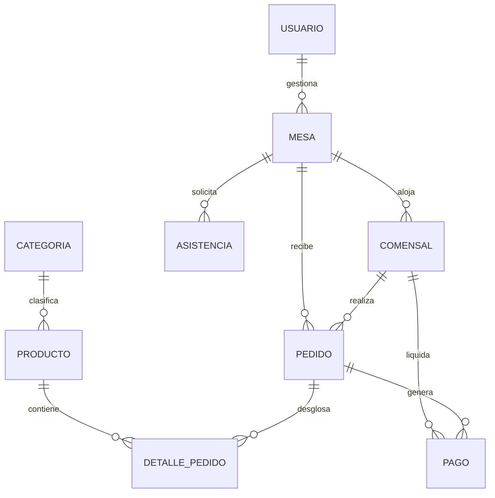

# Reporte Técnico Detallado: Arquitectura, Herramientas y Buenas Prácticas

Este documento contiene la recomendación tecnológica detallada para el **Frontend** y el diseño de la **Base de Datos** de **SwiftTable**, estructurado especialmente para responder a los requerimientos técnicos y metodológicos de los entregables universitarios.

---

## 1. Recomendación y Herramientas del Frontend

### A. ¿Qué Framework usar? (Recomendación: Sticking with React)
El proyecto actual cuenta con un desarrollo bastante avanzado en **React 19 (con Vite)**. **No se recomienda cambiar a Angular o Vue** por las siguientes razones de peso:
1. **Curva de Aprendizaje y Tiempo:** Angular es un framework monolítico y pesado que requiere TypeScript estricto, inyección de dependencias compleja y una estructura de carpetas muy rígida. Cambiar ahora retrasaría semanas la entrega del 4to y 5to informe.
2. **Modularidad y Ligereza:** SwiftTable es una SPA (Single Page Application) móvil-first. React + Vite proporciona tiempos de compilación casi instantáneos (HMR) y paquetes ligeros (`bundle size` reducido), lo cual es ideal para comensales que acceden desde redes móviles escaneando un código QR.
3. **Ecosistema Móvil:** La comunidad de React tiene componentes más sencillos y eficientes para animaciones móviles y manipulación de estados de carrito de compras locales (`localStorage`).

### B. Herramientas Recomendadas para potenciar el Frontend
Para pasar del actual aspecto de wireframe a un frontend premium:
* **Iconos:** **`lucide-react`** (ya instalada en tu `package.json`). Permite usar iconos SVG modernos de carga rápida (como `Coffee`, `Flame`, `Check`, `Loader`, `User`) en lugar de emojis de texto.
* **Estilado Estético:** **Vanilla CSS con variables CSS nativas** (el archivo `index.css` ya cuenta con esto, solo hay que pulir los colores, añadir sombras difusas y desenfoque `backdrop-filter` para el efecto de cristal). *Nota: Si deseas acelerar desarrollos de grillas complejas o responsivas, Tailwind CSS es una opción viable, pero refinar el CSS actual es más rápido y mantiene el control total del estilo.*
* **Ruteo:** **`react-router-dom` v7** (ya integrado). Facilita rutas amigables como `/mesa/7/menu` y `/mesa/7/lobby`.
* **Validación de Formularios:** Uso de hooks nativos de React o la librería ligera **`zod`** (para validación de esquemas y evitar entradas incorrectas en el PIN o en el nombre de usuario).
* **Gestión de Estado:** `useContext` o simple State de React para el Carrito. No es necesario Redux para este alcance, manteniendo el código limpio y fácil de depurar.

---

## 2. Recomendación y Buenas Prácticas de Base de Datos

El motor de base de datos elegido (**PostgreSQL**) es la opción industrial estándar más recomendada. Utilizar el ORM **SQLAlchemy** en Python permite escribir código limpio e independiente del motor.

### A. Prácticas y Patrones de Diseño Recomendados
Para obtener la máxima puntuación en los informes de diseño de base de datos, debes implementar los siguientes puntos:
1. **Control de Migraciones con Alembic:** No dependas únicamente de `Base.metadata.create_all()`. Utilizar **Alembic** permite registrar el historial de versiones del esquema de base de datos (DDL). Esto es altamente valorado en el ámbito profesional y académico.
2. **Conexiones Seguras y Pool de Conexiones:** Configurar el pool en SQLAlchemy (usando `pool_size=5`, `max_overflow=10`, `pool_recycle=3600`) para evitar fugas de conexiones y saturación de la base de datos en la nube (especialmente en servicios gratuitos como Neon o Render que limitan las conexiones simultáneas).
3. **Estrategia de Eliminación (Cascade y Soft-Delete):**
   * Configurar `cascade="all, delete-orphan"` en la relación `Pedido -> DetallePedido`. Si eliminas un pedido, sus detalles deben borrarse automáticamente.
   * Evitar la eliminación en cascada en `Producto -> DetallePedido`. Si eliminas un plato del menú, no debes romper los registros históricos de pedidos pasados. Para esto, se usa un estado lógico (`disponible` / `no_disponible`) en lugar de borrar la fila física del plato de la base de datos (Soft-Delete).
4. **Índices de Rendimiento (Indexes):**
   * Añadir índices explícitos en las columnas utilizadas frecuentemente en cláusulas `WHERE` o `JOIN`: `id_mesa` en la tabla Comensal, `id_pedido` en DetallePedido, y `correo` en la tabla Usuario.

---

### B. Esquema de Tablas Sugerido y Relaciones

El modelo relacional propuesto cuenta con 9 tablas principales mapeadas a tus historias de usuario:

#### Detalle de las Tablas y sus Campos Clave:

1. **`Mesa` (Mesas físicas del restaurante):**
   * `id_mesa` (PK - Serial)
   * `numero` (Integer - Único)
   * `estado` (Enum: `libre`, `ocupada`, `por_limpiar`)
   * `codigo_qr` (String - URL o ruta local a la imagen del QR generado)
   * `pin` (String - Código de 4 dígitos autogenerado para acceso grupal)

2. **`Comensal` (Usuarios temporales en la mesa):**
   * `id_comensal` (PK - Serial)
   * `nombre` (String - Apodo ingresado por el usuario)
   * `avatar` (String - Emoji o identificador del avatar de animal elegido)
   * `id_mesa` (FK a `Mesa`)

3. **`Categoria` (Clasificaciones del menú):**
   * `id_categoria` (PK - Serial)
   * `nombre` (String - ej: "Pollos", "Bebidas", "Entradas")
   * `descripcion` (String - Opcional)

4. **`Producto` (Platos y bebidas disponibles):**
   * `id_producto` (PK - Serial)
   * `nombre` (String)
   * `descripcion` (String)
   * `precio` (Numeric 10,2)
   * `estado` (Enum: `disponible`, `agotado`)
   * `id_categoria` (FK a `Categoria`)

5. **`Pedido` (Orden general de la mesa o comensal):**
   * `id_pedido` (PK - Serial)
   * `fecha_hora` (DateTime - Por defecto `now()`)
   * `estado` (Enum: `pendiente`, `en_cocina`, `listo`, `entregado`)
   * `id_mesa` (FK a `Mesa`)
   * `id_comensal` (FK a `Comensal` - Indica quién originó el pedido)

6. **`DetallePedido` (Desglose individual de cada plato ordenado):**
   * `id_detalle` (PK - Serial)
   * `id_pedido` (FK a `Pedido`)
   * `id_producto` (FK a `Producto`)
   * `cantidad` (Integer)
   * `precio_unitario` (Numeric 10,2 - Guardado históricamente por si cambian los precios en el menú)
   * `subtotal` (Numeric 10,2)
   * `nota` (String - ej: "Sin ensalada", "Hielo al vaso")

7. **`Pago` (Registro financiero de la cuenta):**
   * `id_pago` (PK - Serial)
   * `id_pedido` (FK a `Pedido`)
   * `id_comensal` (FK a `Comensal` - Quién realiza el pago)
   * `monto` (Numeric 10,2)
   * `propina` (Numeric 10,2 - Opcional)
   * `metodo_pago` (Enum: `yape`, `plin`, `tarjeta`, `efectivo`)
   * `fecha_pago` (DateTime)

8. **`Asistencia` (Llamados del cliente al personal):**
   * `id_asistencia` (PK - Serial)
   * `id_mesa` (FK a `Mesa`)
   * `tipo` (Enum: `llamar_mesero`, `pedir_cuenta`)
   * `estado` (Enum: `pendiente`, `atendido`)
   * `fecha_hora` (DateTime)

9. **`Usuario` (Cuentas del personal administrativo/meseros):**
   * `id_usuario` (PK - Serial)
   * `nombre` (String)
   * `correo` (String - Único)
   * `contrasena` (String - Cifrada en hash con bcrypt)
   * `rol` (Enum: `administrador`, `mesero`, `cocina`)
   * `estado` (Enum: `activo`, `inactivo`)
