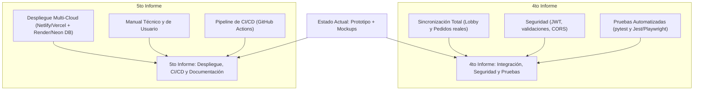

# Reporte de Diagnóstico y Plan de Mejoras — SwiftTable (Mesa Virtual)

Este reporte detalla el diagnóstico del estado actual del proyecto **SwiftTable** y propone un conjunto de mejoras prioritarias tanto a nivel visual (Frontend) como lógico (Backend y Base de Datos) para completar con éxito los entregables correspondientes al **4to y 5to Informe**.

---

## 1. Diagnóstico del Estado Actual

### A. Frontend (Cliente React)
* ⚠️ **Estilo de Boceto (Wireframe):** Como lo demuestran los prefijos de las clases CSS (`wf-block`, `wf-label`, `wf-btn-solid`, `wf-btn-outline`), la interfaz actual se diseñó para imitar un prototipo en blanco y negro o de baja fidelidad (wireframe). Utiliza colores grises monótonos, bordes simples y estructuras rígidas que no reflejan una aplicación premium.
* ⚠️ **Uso de Emojis como Iconos:** Se emplean emojis nativos (🍗, 🥤, 🥔, 🍩) dentro de recuadros con líneas discontinuas. Para un producto final, esto reduce la percepción de calidad. Se requiere el uso de iconos vectoriales consistentes (como `lucide-react`) o imágenes reales de platillos.
* ⚠️ **Datos Simulados (Mock Data) Acoplados:** 
  * En la vista de **Lobby** (`Lobby.jsx`), la lista de participantes está cableada estáticamente en el código (`Carlos`, `Ana`, `Luis`).
  * En la vista de **Pedido Grupal** (`PedidoGrupal.jsx`), la lista de pedidos de los compañeros de mesa también está quemada en el código.
  * El frontend cuenta con fallbacks robustos, pero no está realizando la sincronización real en tiempo real que amerita una "Mesa Virtual".
* ⚠️ **Estilos en Línea (Inline Styles):** Se abusa de atributos `style={{ marginBottom: '16px', ... }}` directamente en el JSX, lo cual dificulta el mantenimiento, rompe la consistencia del sistema de diseño y ralentiza la carga.

### B. Backend (FastAPI) y Base de Datos (PostgreSQL)
* 🛠️ **Arquitectura Base Sólida:** El uso de FastAPI, SQLAlchemy y Pydantic está bien estructurado y sigue buenas prácticas (modelos relacionales claros, endpoints divididos en módulos).
* ⚠️ **Dependencia Rígida de PostgreSQL en Local:** El archivo `config.py` y `main.py` intentan inicializar las tablas de la base de datos PostgreSQL al arrancar. Si el desarrollador o el evaluador no tiene una base de datos PostgreSQL activa en su máquina local con la contraseña exacta `fisi2025`, el servidor uvicorn crashea instantáneamente. Falta un mecanismo de fallback automático a SQLite para desarrollo local sin fricciones.
* ⚠️ **Falta de Sincronización en Tiempo Real:** El backend no cuenta con soporte para Server-Sent Events (SSE) ni WebSockets. Para una aplicación grupal de mesa virtual, esto obliga a realizar HTTP Polling constante en el frontend, lo cual satura el servidor de peticiones innecesarias.

---

## 2. Plan de Acción y Mejoras Recomendadas

### A. Rediseño Estético (Frontend Premium y Wow Factor)
Para transformar la interfaz de un "boceto gris" a un producto de alta calidad y muy estético:
1. **Esquema de Color Gastronómico:** Reemplazar los grises por una paleta oscura sofisticada basada en HSL (por ejemplo, fondos en `#0b0a0a` y tarjetas con `#141212`) combinada con tonos cálidos y apetitosos (acentos naranja-fuego, gradientes de ámbar, y badges doradas).
2. **Glassmorphism (Efectos de Vidrio Esmerilado):** Implementar transparencias con filtros de desenfoque (`backdrop-filter: blur(12px)`) sobre tarjetas flotantes para darle una apariencia moderna y tridimensional.
3. **Reemplazo de Emojis:** Utilizar los componentes de `lucide-react` para iconos de interfaz e integrar imágenes reales (generadas o seleccionadas de forma elegante) para las categorías y platos.
4. **Mockups de Celular Realistas:** Añadir un contenedor contenedor estético para pantallas de escritorio que simule un marco de smartphone físico (iPhone o Android) con su respectiva barra de estado.
5. **Micro-animaciones Dinámicas:** Agregar transiciones fluidas al presionar los botones, efectos hover con escalado suave en las tarjetas de platos, y spinners o loaders interactivos que mejoren la experiencia.

### B. Integración Lógica Real (Adiós a los Datos Mock)
1. **Lobby Dinámico:** Crear un endpoint en el backend (`/api/mesas/{id_mesa}/comensales`) para retornar la lista real de personas registradas en la mesa, y hacer que el frontend consuma este endpoint usando un intervalo corto de actualización (`polling` cada 3 segundos) o Server-Sent Events (SSE).
2. **Pedido Grupal Sincronizado:** Permitir que cada comensal envíe su selección individual al backend, y que la vista consolidada agrupe y desglose el total combinando las consultas reales del backend.
3. **Mecanismo de SQLite Fallback:** Modificar `connection.py` para detectar si PostgreSQL está disponible; si no lo está o si falla el intento inicial, crear y conectar automáticamente a una base de datos local `swifttable.db` en SQLite. Esto asegura que el backend arranque siempre sin importar el entorno del evaluador.

---

## 3. Plan de Avance para los Entregables Finales (4to y 5to Informe)

Para presentar todo de golpe y asegurar la calificación máxima, el proyecto debe estructurar los siguientes apartados técnicos en los documentos finales:

### 📋 4to Informe: Integración, Seguridad y Pruebas

#### 1. Integración Total
* **Lógica de Pedidos Cruzada:** El estado de un comensal debe guardarse en base de datos. Al unirse, la base de datos incrementa los integrantes de la mesa en tiempo real.
* **Control de Sesiones de Mesa:** Implementación completa del ciclo de PIN. Al ingresar un código PIN incorrecto, se bloquea el acceso en base a la historia de usuario `HU-01`.

#### 2. Implementación de Seguridad
* **Autenticación del Personal:** Integrar el inicio de sesión del Administrador/Mesero utilizando JSON Web Tokens (JWT) y cifrado `bcrypt` para las contraseñas.
* **CORS y Sanitización:** Asegurar las cabeceras de origen permitiendo únicamente peticiones del dominio del frontend desplegado. Validar y limpiar cualquier entrada de texto para evitar ataques XSS o inyecciones de código.

#### 3. Plan de Pruebas Automatizadas
* **Pruebas del Backend (FastAPI):**
  * Escribir pruebas unitarias con `pytest` para verificar las rutas de mesas, productos y creación de pedidos.
  * Pruebas de integración para comprobar que la lógica de cobro (individual/dividido) calcula correctamente los subtotales, propinas e IGV.
* **Pruebas del Frontend (React):**
  * Configurar Jest o Vitest para validar los componentes interactivos clave (como el PinDisplay y el Carrito).
  * Realizar pruebas básicas End-to-End (E2E) simulando el flujo completo de un usuario usando Playwright o Cypress.

---

### 🚀 5to Informe: Despliegue, Publicación y Presentación Final

#### 1. Despliegue Multi-Cloud (Desacoplado)
* **Frontend:** Alojado en **Netlify** o **Vercel** de manera gratuita, con el enrutamiento SPA configurado (`_redirects` o `vercel.json`).
* **Backend:** Publicado como un servicio web persistente en **Render**, **Railway** o **Fly.io** que apunta al repositorio GitHub.
* **Base de Datos:** Alojada en una instancia en la nube (PostgreSQL gestionado en **Neon.tech** o **Render Databases**).

#### 2. Configuración de Pipeline CI/CD
* Creación de un workflow en **GitHub Actions** (`.github/workflows/deploy.yml`) que:
  1. Ejecute el set de pruebas unitarias al hacer `push` a la rama `main`.
  2. Compile el frontend de React.
  3. Despliegue automáticamente el código actualizado a producción en caso de que las pruebas pasen satisfactoriamente.

#### 3. Documentación y Entregables Finales
* **Manual Técnico:** Arquitectura física y lógica, diccionario de datos, explicación del esquema de base de datos final y variables de entorno del sistema.
* **Manual de Usuario:** Guía visual interactiva paso a paso para el comensal (escanear QR, unir a lobby, seleccionar comida, pagar) y para el personal del restaurante (dashboard e historial de pedidos).
* **Presentación y Video Demo:** Demostración en vivo del flujo grupal real desde dos navegadores/pantallas en simultáneo mostrando la reactividad y sincronización entre dispositivos.
